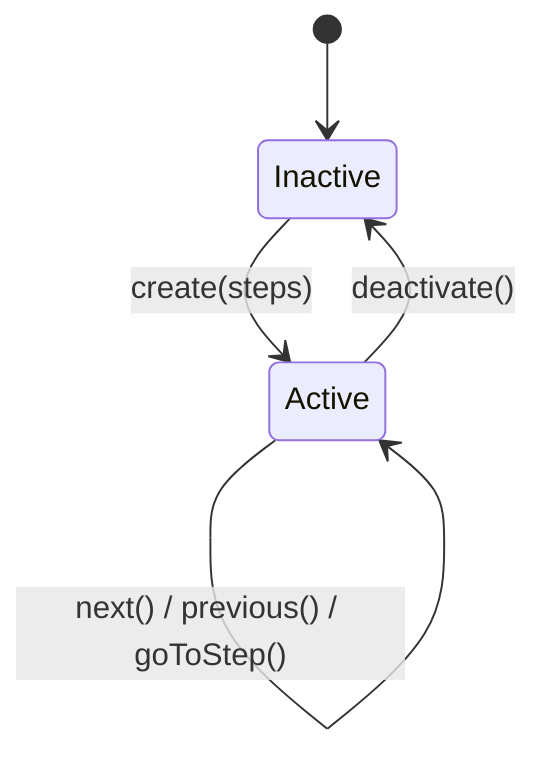
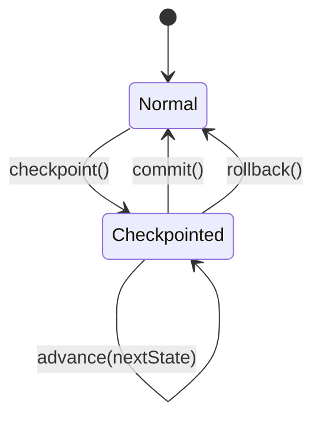

# State Modeling

Model application state as XOR discriminated unions and immutable state machines with compile-time safety. States are mutually exclusive value objects; transitions produce new instances; invalid transitions return `this` (guard condition); all branching uses ts-pattern `.exhaustive()`.

## Core Rules

| # | Rule | Avoid | Use Instead |
|---|------|-------|-------------|
| 1 | **XOR Principle** | Optional fields shared across states (`status: string; data?: T; error?: E`) | Discriminated union where each variant owns completely different properties |
| 2 | **Discriminant is `type`** | String enums, boolean flags, numeric codes as state discriminant | `readonly type: "idle" \| "loading" \| "ready"` string literal |
| 3 | **Immutable transitions** | Mutating `this._state.status = "ready"` in place | Return new instance: `new StateMachine(nextState)` |
| 4 | **Guard conditions return `this`** | Throwing from transition methods | Return `this` for invalid transitions (no-op) |
| 5 | **Exhaustive matching** | `switch` with `default` that swallows unknown states | `ts-pattern` `match(state).with(...).exhaustive()` |
| 6 | **No React imports in state machines** | `useState`, hooks, or React types in state machine files | Pure TypeScript in `src/core/`; React integration via props |

---

## XOR State Types

The XOR principle means each state variant owns **completely different** properties. No optional fields leak across variants. If a property exists on one variant, it must not exist (even as `undefined`) on another.

### The Problem: Shared Optional Fields

```typescript
// BAD: "Bag of optionals" -- allows impossible combinations
interface RequestState {
  status: "idle" | "loading" | "success" | "error"
  data?: User        // exists when success, undefined otherwise
  error?: string     // exists when error, undefined otherwise
  progress?: number  // exists when loading, meaningless otherwise
}

// Nothing prevents: { status: "idle", data: someUser, error: "oops" }
```

### The Solution: XOR Discriminated Union

```typescript
// GOOD: Each variant owns exactly the properties it needs
type RequestState =
  | { readonly type: "idle" }
  | { readonly type: "loading"; readonly progress: number }
  | { readonly type: "success"; readonly data: User }
  | { readonly type: "error"; readonly error: string }
```

### Existing XOR Pattern: RenderStatus

From `frontend/packages/mermaid/src/core/RenderStateManager.ts`:

```typescript
export type RenderStatus =
  | { readonly type: "idle" }
  | { readonly type: "loading" }
  | { readonly type: "success"; readonly svgContent: string; readonly svgDimensions: SvgDimensions }
  | { readonly type: "error"; readonly message: string }
```

Each variant carries only the properties meaningful in that state. `svgContent` and `svgDimensions` only exist during `success`. `message` only exists during `error`.

### Existing XOR Pattern: PinchGestureState

From `frontend/packages/mermaid/src/types/index.ts`:

```typescript
export type PinchGestureState =
  | { readonly type: "idle" }
  | {
      readonly type: "singleTouch"
      readonly touch: TouchPoint
      readonly panStartX: number
      readonly panStartY: number
    }
  | {
      readonly type: "pinch"
      readonly touches: readonly [TouchPoint, TouchPoint]
      readonly prevDistance: number
      readonly prevCenter: { readonly x: number; readonly y: number }
    }
```

`touch` only exists during `singleTouch`. `touches` and `prevDistance` only exist during `pinch`.

### Compound XOR: Nested Discriminated Unions

When states have sub-states, nest discriminated unions:

```typescript
type EditorState =
  | { readonly type: "uninitialized" }
  | { readonly type: "initializing"; readonly attempt: number }
  | {
      readonly type: "ready"
      readonly mode:
        | { readonly type: "viewing"; readonly content: string }
        | { readonly type: "editing"; readonly content: string; readonly dirty: boolean }
    }
  | { readonly type: "error"; readonly message: string }
```

---

## State Machine as Immutable Value Object

For finite state with discrete transitions. Every transition returns a new instance -- never mutates. The parent store or React `useState` holds the reference.

### State Diagram (Mermaid)

Include a mermaid diagram in code comments or documentation for every state machine with 3+ states:



### Existing Pattern: StepZoomManager

```typescript
interface StepZoomState {
  readonly mode: "inactive" | "active"
  readonly currentIndex: number
  readonly steps: readonly StepInfo[]
}

const INACTIVE_STATE: StepZoomState = {
  mode: "inactive",
  currentIndex: 0,
  steps: [],
}

export class StepZoomManager {
  private constructor(private readonly _state: StepZoomState) {}

  static inactive(): StepZoomManager {
    return new StepZoomManager(INACTIVE_STATE)
  }

  static create(steps: readonly StepInfo[]): StepZoomManager {
    if (steps.length === 0) return StepZoomManager.inactive()
    return new StepZoomManager({ mode: "active", currentIndex: 0, steps })
  }

  get isActive(): boolean { return this._state.mode === "active" }
  get currentIndex(): number { return this._state.currentIndex }

  next(): StepZoomManager {
    if (!this.isActive) return this                    // Guard
    const nextIndex = Math.min(this._state.currentIndex + 1, this._state.steps.length - 1)
    if (nextIndex === this._state.currentIndex) return this  // Guard: at end
    return new StepZoomManager({ ...this._state, currentIndex: nextIndex })
  }

  deactivate(): StepZoomManager {
    if (!this.isActive) return this
    return StepZoomManager.inactive()
  }
}
```

**Rules:**
- `private constructor` + `static inactive()` or `static create()` factory
- Every transition returns a **new instance** -- never mutate
- `readonly` on all internal state fields
- Guard conditions: return `this` (no-op) for invalid transitions
- No React imports -- pure TypeScript in `src/core/`

### Pattern Template

```typescript
class MyMachine {
  private constructor(private readonly _state: MyState) {}
  static initial(): MyMachine { return new MyMachine({ type: "state_a" }) }

  get state(): MyState { return this._state }
  get type(): MyState["type"] { return this._state.type }

  // Transition with guard
  toB(/* args */): MyMachine {
    if (this._state.type !== "state_a") return this
    return new MyMachine({ type: "state_b", /* ... */ })
  }
}
```

---

## Recoverability: State Rollback

When a multi-step operation can fail midway, snapshot the current state before beginning. On failure, restore the snapshot.

### Snapshot Pattern

```typescript
class RecoverableStateMachine<S extends { readonly type: string }> {
  private readonly _state: S
  private readonly _snapshot: S | null

  private constructor(state: S, snapshot: S | null) {
    this._state = state
    this._snapshot = snapshot
  }

  static create<S extends { readonly type: string }>(initial: S): RecoverableStateMachine<S> {
    return new RecoverableStateMachine(initial, null)
  }

  get state(): S { return this._state }
  get hasSnapshot(): boolean { return this._snapshot !== null }

  /** Create a snapshot of current state before a risky transition. */
  checkpoint(): RecoverableStateMachine<S> {
    return new RecoverableStateMachine(this._state, this._state)
  }

  /** Apply a new state (after checkpoint). */
  advance(nextState: S): RecoverableStateMachine<S> {
    return new RecoverableStateMachine(nextState, this._snapshot)
  }

  /** Restore to snapshot. Returns self if no snapshot exists. */
  rollback(): RecoverableStateMachine<S> {
    if (this._snapshot === null) return this
    return new RecoverableStateMachine(this._snapshot, null)
  }

  /** Clear snapshot (commit the current state). */
  commit(): RecoverableStateMachine<S> {
    return new RecoverableStateMachine(this._state, null)
  }
}
```

### State Diagram: Recoverable Transitions



---

## Robustness Patterns

### Exhaustive Matching with ts-pattern

All branching on discriminated unions uses `ts-pattern` `.exhaustive()`. This guarantees compile-time errors when a new variant is added.

```typescript
import { match } from "ts-pattern"

function renderStatus(status: RenderStatus): string {
  return match(status)
    .with({ type: "idle" }, () => "Ready")
    .with({ type: "loading" }, () => "Loading...")
    .with({ type: "success" }, (s) => `Loaded: ${s.svgContent.length} chars`)
    .with({ type: "error" }, (s) => `Error: ${s.message}`)
    .exhaustive()
}
```

**Prefer `ts-pattern` `.exhaustive()` over `switch` + `assertNever`.** Use `assertNever` only in non-expression contexts where `ts-pattern` cannot be used.

### Phantom Types for State-Dependent Capabilities

When certain operations are only valid in specific states, use phantom type parameters to encode capability at the type level:

```typescript
declare const _brand: unique symbol
type Draft = { readonly [_brand]: "draft" }
type Published = { readonly [_brand]: "published" }

class Document<State = Draft> {
  private constructor(
    private readonly _content: string,
    private readonly _state: State,
  ) {}

  static create(content: string): Document<Draft> {
    return new Document(content, {} as Draft)
  }

  edit(this: Document<Draft>, content: string): Document<Draft> {
    return new Document(content, this._state)
  }

  publish(this: Document<Draft>): Document<Published> {
    return new Document(this._content, {} as Published)
  }
}

const doc = Document.create("hello")
doc.publish()         // OK -- draft -> published

const published = doc.publish()
published.edit("x")   // COMPILE ERROR -- edit not available on Published
```

### Branded Types for Identifiers

Prevent mixing up string identifiers across different domains:

```typescript
declare const _brand: unique symbol
type Brand<T, B extends string> = T & { readonly [_brand]: B }

type NodeId = Brand<string, "NodeId">
type DomId = Brand<string, "DomId">

function createNodeId(raw: string): NodeId {
  return raw as NodeId
}
```

---

## Scale-Independent Template

This template works for 3-state and 10-state machines alike.

### Step 1: Define XOR State Union

```typescript
type MyState =
  | { readonly type: "state_a"; /* props exclusive to A */ }
  | { readonly type: "state_b"; /* props exclusive to B */ }
  | { readonly type: "state_c"; /* props exclusive to C */ }
```

### Step 2: Build State Machine

```typescript
class MyMachine {
  private constructor(private readonly _state: MyState) {}
  static initial(): MyMachine { return new MyMachine({ type: "state_a" }) }

  get state(): MyState { return this._state }
  get type(): MyState["type"] { return this._state.type }

  toB(/* args */): MyMachine {
    if (this._state.type !== "state_a") return this
    return new MyMachine({ type: "state_b", /* ... */ })
  }
}
```

### Step 3: Exhaustive Matching at Consumption

```typescript
match(machine.state)
  .with({ type: "state_a" }, (s) => /* render A */)
  .with({ type: "state_b" }, (s) => /* render B */)
  .with({ type: "state_c" }, (s) => /* render C */)
  .exhaustive()
```

---

## React Integration

### Immutable Value Object in Parent Store

State machines are typically consumed via the parent store's snapshot:

```typescript
// src/core/StepZoomManager.ts -- NO React imports
class StepZoomManager {
  private constructor(private readonly _state: StepZoomState) {}
  static inactive(): StepZoomManager { /* ... */ }
  next(): StepZoomManager { /* returns new instance */ }
}

// src/store/MermaidStore.ts -- Bridge layer
class MermaidStore {
  private _stepZoom: StepZoomManager

  nextStep(): void {
    const newStepZoom = this._stepZoom.next()
    if (newStepZoom !== this._stepZoom) {
      this._stepZoom = newStepZoom
      this.notify()
    }
  }
}

// Component -- reads from snapshot
function StepControls({ store }: { store: MermaidStore }) {
  const snapshot = useSyncExternalStore(store.subscribe, store.getSnapshot)
  const { stepZoom } = snapshot

  return match({ isActive: stepZoom.isActive })
    .with({ isActive: true }, () => (
      <div>Step {stepZoom.currentIndex + 1} of {stepZoom.totalSteps}</div>
    ))
    .with({ isActive: false }, () => null)
    .exhaustive()
}
```

---

## Decision Matrix

| Need | Pattern | When to Apply |
|------|---------|---------------|
| Finite states, consumed via parent store | Immutable value object in store | StepZoomManager, RenderStateManager |
| Finite states, standalone in component | Immutable value object + `useState` | Simple toggle, form wizard |
| Multi-step with failure recovery | Snapshot + rollback pattern | Batch operations, multi-step forms |
| Type-safe branching on state | `ts-pattern` `.exhaustive()` | All rendering of discriminated unions |
| Preventing invalid identifier mixing | Branded types | IDs for different entity types |
| Operations valid only in certain states | Phantom types on `this` | State-dependent capabilities |
| Simple 2-3 state toggle | Immutable value object | Guard conditions, return `this` |
| Complex 5+ state workflow | Same immutable value object -- scale-independent | More variants, same pattern |

---

## Code Review Checklist

- [ ] State types use XOR discriminated unions -- no optional fields shared across variants
- [ ] Discriminant field is `type` (string literal), consistent with project convention
- [ ] State machine has `private constructor` + `static initial()` / `static create()` factory
- [ ] All transitions return new instances -- no in-place mutation
- [ ] Invalid transitions return `this` (guard condition)
- [ ] All branching on unions uses `ts-pattern` `.exhaustive()`
- [ ] State machine file in `src/core/` with NO React imports
- [ ] Mermaid state diagram documented for machines with 3+ states
- [ ] All state interface fields are `readonly`

## Validation Commands

```bash
# Optional fields on discriminated union types (potential XOR violations)
grep -rn '?\s*:' frontend/packages/mermaid/src/core --include='*.ts' | grep -i 'state\|type'

# switch statements without exhaustive (prefer ts-pattern)
grep -rn 'switch.*\.type' frontend/packages/mermaid/src --include='*.ts' --include='*.tsx'

# ts-pattern exhaustive usage audit
grep -rn '\.exhaustive()' frontend/packages/mermaid/src --include='*.ts' --include='*.tsx'
```

## References

- `.claude/skills/core-class/SKILL.md` -- Immutable manager class architecture, guard conditions
- `.claude/skills/state-management/SKILL.md` -- useSyncExternalStore, store composition
- `frontend/packages/mermaid/src/core/RenderStateManager.ts` -- XOR discriminated union (RenderStatus)
- `frontend/packages/mermaid/src/core/StepZoomManager.ts` -- Immutable state machine
- `frontend/packages/mermaid/src/types/index.ts` -- PinchGestureState compound XOR
- [ts-pattern](https://github.com/gvergnaud/ts-pattern) -- Exhaustive pattern matching for TypeScript
